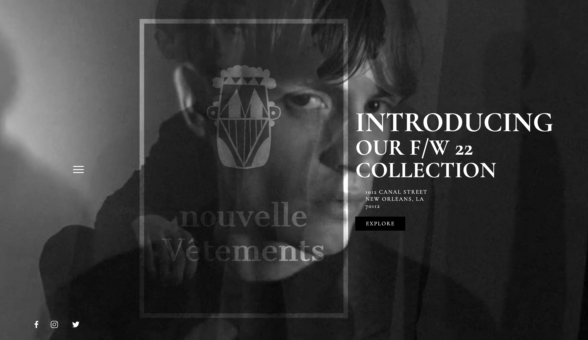
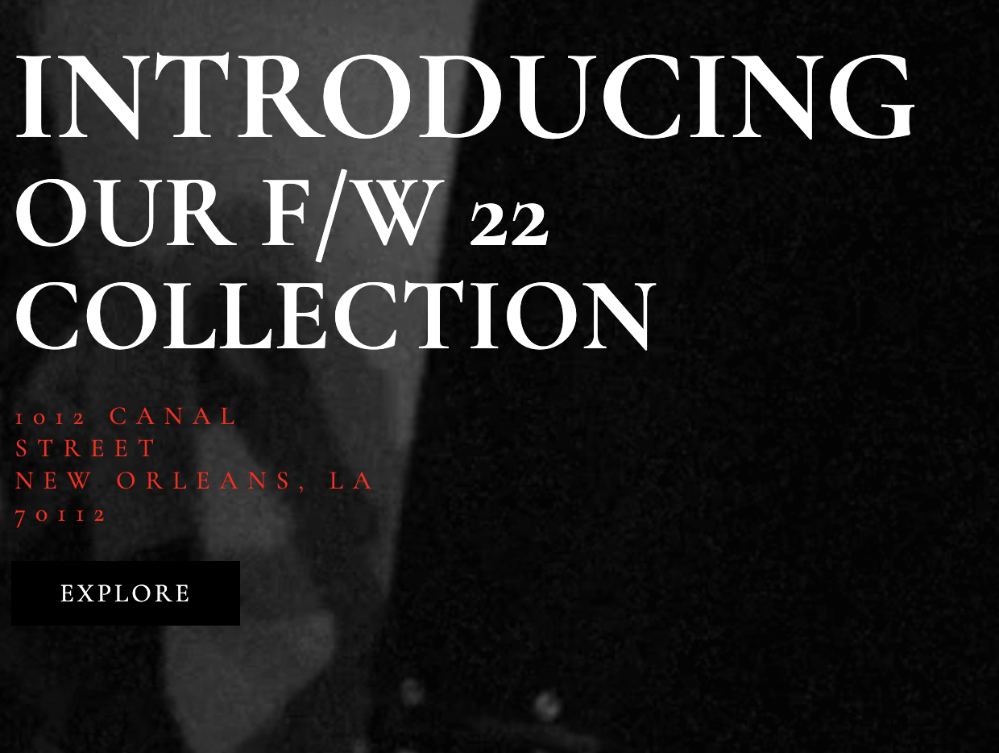
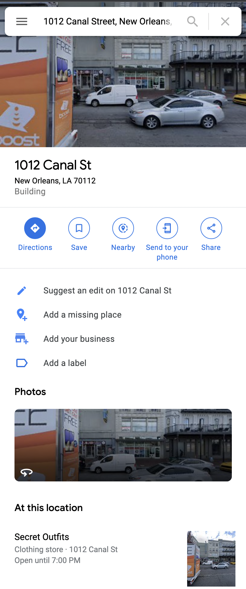
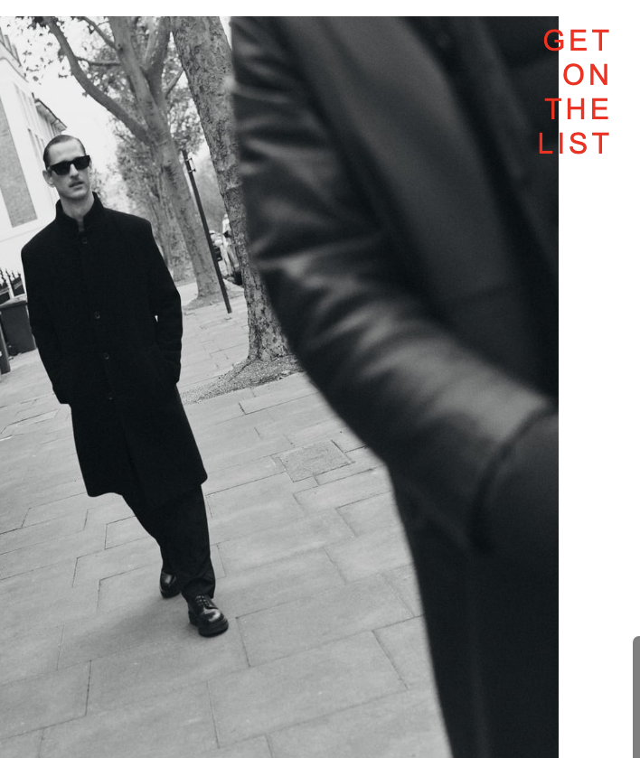
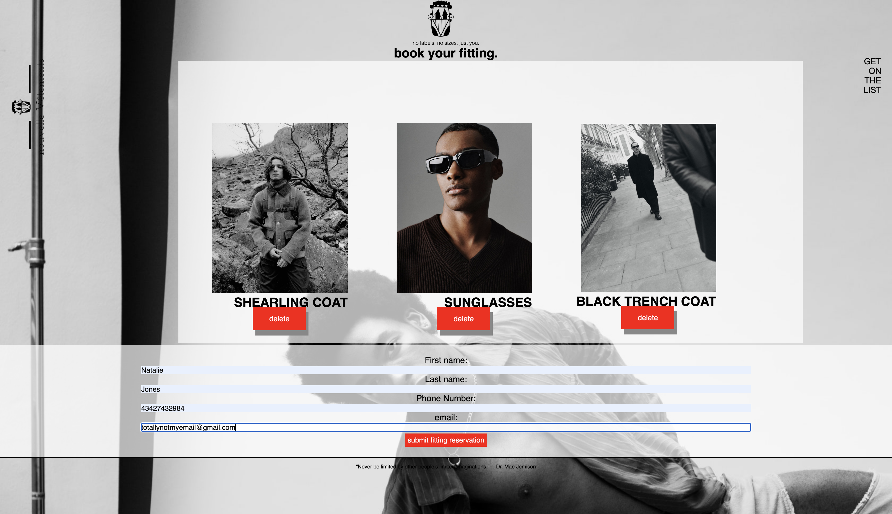
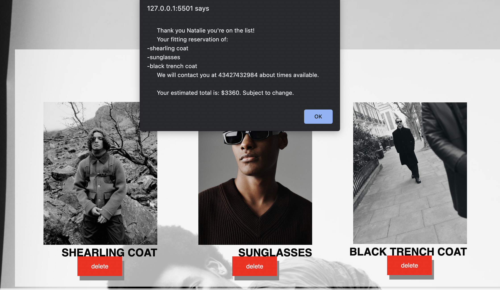

#Nouvelle-Vetements
Nouvelle-Vetements is a project I built using what I have learned during my first 8 weeks of foundations within the BrightPaths program.

Tech Stack: Vanilla JS, NodeJS, Express, Axios

## MVP Featurues

User Should be able to: 

- Add items to the bag.

- Remove Items from the bag

- Provide name, number, and email.

- Upon successful submission, users should be informed of the items they have reserved under their name using the info given.

[Demo video](https://www.youtube.com/watch?v=tHQg8PQm3dg "Demo video")

## Walkthrough
First  the user is directed to the landing page.

If the user clicks on the address, they will be directed to a google map allowing  them to quickly get directions.

When the user clicks "explore" they will be directed to the collection page, where they can see what's available and add it to their bag.

After the user has decided what they want to add to their bag, they can click "get on the list" to finalize their decision.

The user will then be show the contents of their bag. If they decide they don't want an item they can delete it. If not they can go ahead and fill in the input boxes.

After submitting the user will be alerted with a successful submission.
